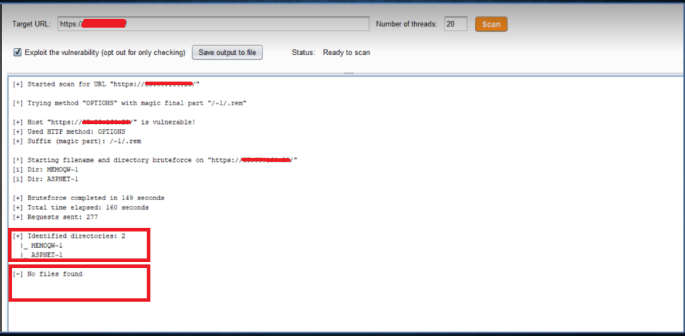
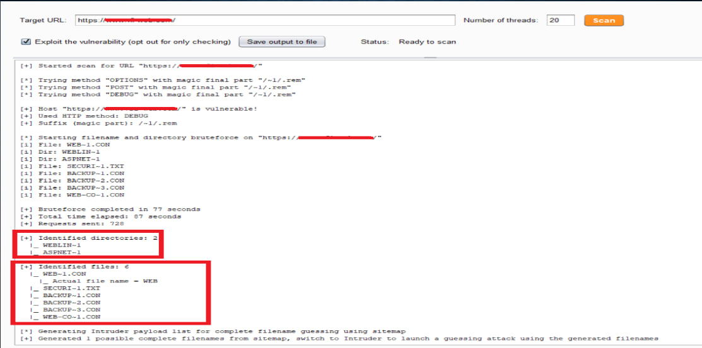
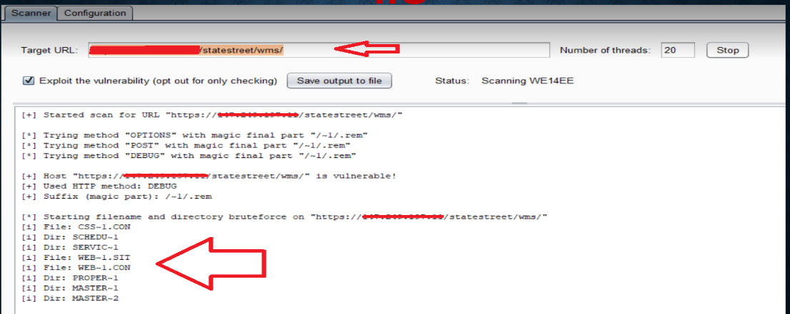
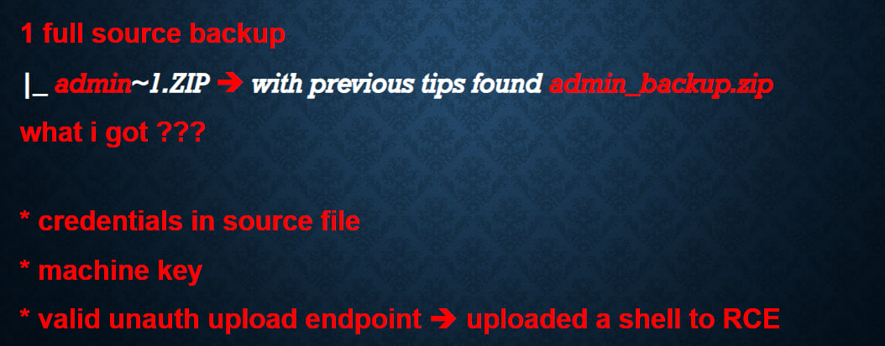
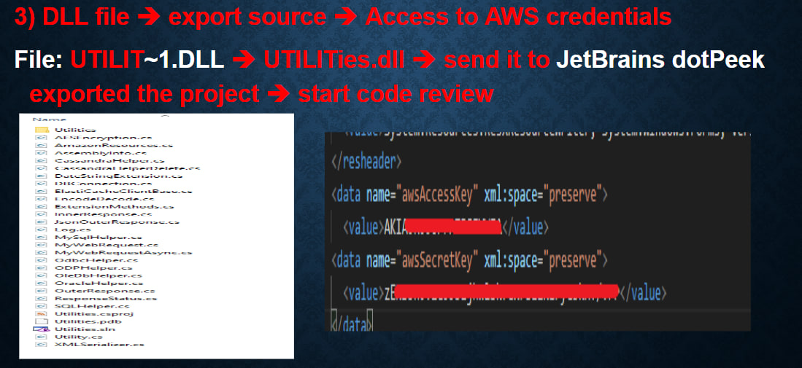

# iis-pentest

Server response headers:
```
Server: Microsoft-IIS
X-Powered-By: ASP.NET
```
Shodan dorks: 
```
> http.title:"IIS"
> ssl:"Tesla Inc." http.title:"IIS"
> ssl.cert.subject.CN:"tesla.com" http.title:"IIS"
```
Try to find:
```
/admin/help.cgi
/admin/help.cgi.bak
/admin/WS_FTP.LOG
/adovbs.inc
/confirm.asp.bak 
/default.asp.bak
/login.asp.bak
/pindex.asp.bak
/rootlogin.asp.bak
/rootlogin.asp.old
/_vti_pvt/service.cnf 
/include/common.inc
/WS_FTP.LOG
service.cnf
_vti_pvt/service.cnf

or try this wordlists:
- iis.txt
- iisfinal.txt
- god.txt

```

Use shortscan or other shortname scanners to enumerate directory and file shortnames:
```
IIS Tilde Enumeration (Burp Extension)
https://github.com/bitquark/shortscan

> shortscan https://url/
> shortscan https://tesla.com/
> shortscan https://tesla.com/admin/
> shortscan https://tesla.com/admin/dashboard

Note: any valid dir endpoint such as 403,401,301,200 etc, scan that endpoint again!!

JetBrains dotPeek -> to analyze files such as dll file and export the source of that file
```









Reverse proxy misconfiguration:
```
If you can find a place where there is a reverse proxy on IIS, you can traverse on the backend server using ..%2f
> /backend/ -> 10.0.0.1/api/
> try /backend/..%2ftest -> 10.0.0.1/test
```

When you manage to get LFD, grab the machine keys from web.conf to pivot to RCE:
```
IIS is one of the easiest targets to get RCE on bc if you can leak the web.conf file, you normally have RCE via deserialization.
VIEWSTATE deserialization parameter
```

Upload shell bypass:
```
shell.aspx.
shell.aspx..
shell.aspx...

and other extensions (.aspx, .asp, .ashx, .config)
```
Upload shell via path traversal:
```
../../../../shell.aspx -> filename
```

HPP Pollution for WAF bypass:
```
> https://site.com/page?parameter=<svg/&parameter=onload=alert(1)>
```
